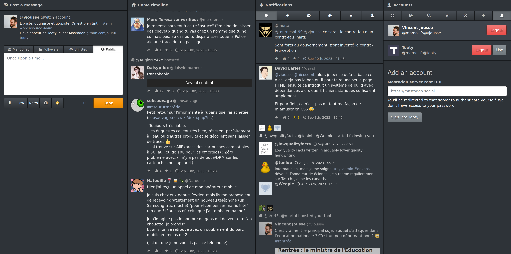

# tooty

An experimental multi-account [Mastodon Web client](https://n1k0.github.io/tooty/v2/) written in Elm. You can find the [Mastodon lib in this repo](https://github.com/vjousse/elm-mastodon-tooty/).

Tooty is a fully static Web application running in recent browsers, you don't need any custom server setup to use it. Just serve it and you're done, or use the [public version hosted on Github Pages](https://n1k0.github.io/tooty/v2/).

If you want to self host Tooty, just [grab a build](https://github.com/n1k0/tooty/archive/gh-pages.zip) and serve it over HTTP.

### Setting up the development environment

    $ npm i

### Starting the dev server

    $ npm run live

### Starting the dev server in live debug mode

    $ npm run debug

### Starting the dev server in live debug mode and watch for css changes

    $ npm run debug:all

### Building

    $ npm run build

### Optimizing

    $ npm run optimize

This command compresses and optimizes the generated js bundle. It usually allows reducing its size by ~75%, at the cost of the JavaScript code being barely readable. Use this command for deploying tooty to production.

### Deploying to gh-pages

    $ npm run deploy

The app should be deployed to https://[your-github-username].github.io/tooty/

Note: The `deploy` command uses the `optimize` one internally.

### Launching testsuite

    $ npm test

## Licence

MIT
